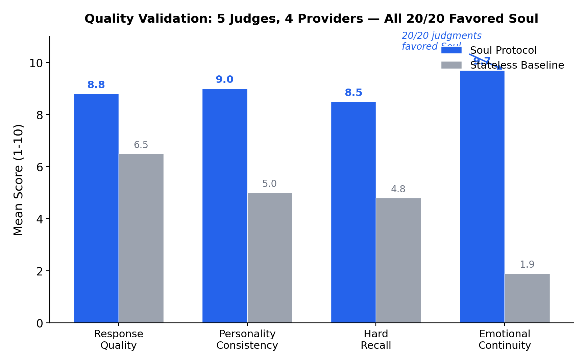
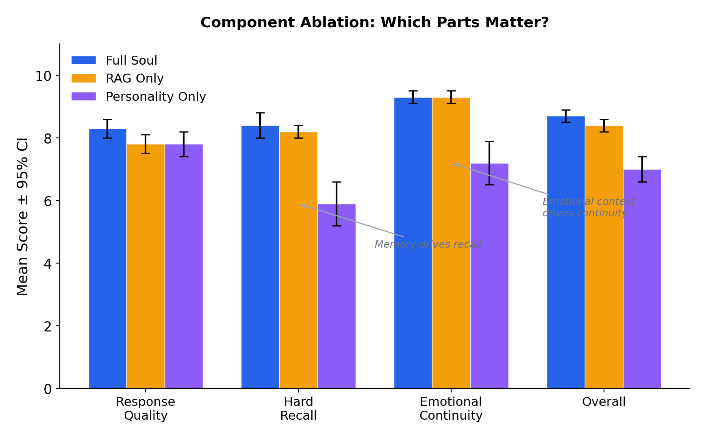
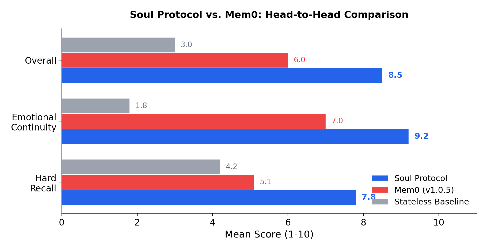

<!-- README.md — soul-protocol open standard -->
<!-- Updated: 2026-03-12 — v0.2.3 release: updated test badge (981), added 1000-turn
     scale results, marked planned features, tightened feature claims. -->

# Soul Protocol

**Portable AI identity, memory, and emotion. An open standard.**

[](https://www.python.org/downloads/)
[](LICENSE)
[](https://github.com/qbtrix/soul-protocol)

---

AI memory systems optimize for retrieval: find the most similar text, stuff it into context, move on. They treat persistence as an IQ problem. But what makes a companion feel real isn't similarity search. It's knowing what matters, what to forget, and who it's becoming.

Soul Protocol gives AI agents persistent identity with psychology-informed memory. Your agent remembers selectively, forms emotional bonds, develops skills, and maintains a personality that evolves over time. The entire state exports as a portable `.soul` file. Switch LLMs, switch platforms, keep the soul.

**[Read the whitepaper](WHITEPAPER.md)** for the full design rationale and empirical validation.

---

## Validated: 5 judges, 4 providers, 20/20 favored Soul

We tested Soul Protocol against stateless baselines using five judge models from four competing AI providers. Every single judgment favored soul-enabled agents.



**Component ablation** — which parts actually matter:



**Head-to-head vs. Mem0** — Soul Protocol outperforms production memory systems:



> Total validation cost: **under $5**. 1,100+ agent simulations, 25 scenario variations, 5 judge models. Plus a **1,000-turn marathon**: 85% recall at 4.9x memory efficiency vs. RAG. Full methodology in the [whitepaper](WHITEPAPER.md#12-empirical-validation).

---

## Architecture: spec + runtime

```
soul_protocol/
├── spec/      624 lines   The protocol. Portable, minimal, no opinions.
├── runtime/  7,495 lines  Reference implementation. Opinionated, batteries-included.
├── cli/                    11-command CLI
└── mcp/                    MCP server (10 tools, 3 resources)
```

**`spec/`** defines what any runtime must implement: Identity, MemoryStore, MemoryEntry, SoulContainer, `.soul` file format, EmbeddingProvider, EternalStorageProvider. Depends on Pydantic only.

**`runtime/`** is one way to run the protocol. OCEAN personality, five-tier memory, psychology pipeline, cognitive engine, bonds, skills, evolution. Other runtimes can implement `spec/` differently.

Like HTTP and nginx. The spec defines the contract. The runtime is one implementation.

---

## Features

| Category | What you get |
|---|---|
| **Memory** | 5-tier: core, episodic, semantic, procedural, knowledge graph |
| **Psychology** | Damasio somatic markers, ACT-R activation decay, LIDA significance gate, Klein self-model |
| **Personality** | OCEAN Big Five with communication style and biorhythms. Structured, not a prompt string. |
| **Bond** | Emotional attachment (0-100 strength). Logarithmic growth, linear decay. |
| **Evolution** | Supervised or autonomous trait mutation with approval workflow |
| **Vector search** | Pluggable EmbeddingProvider. Ships HashEmbedder and TFIDFEmbedder. |
| **Encryption** | AES-256-GCM encryption at rest for .soul files (scrypt key derivation) |
| **GDPR deletion** | Targeted memory deletion with cascade logic and audit trail |
| **Eternal storage** | Archive to decentralized storage (mock providers, production planned) |
| **Portability** | `.soul` ZIP archive. JSON inside. Rename to .zip and read it. |
| **Integration** | Single `CognitiveEngine.think()` method. Plug in any LLM. |
| **Cross-language** | JSON Schemas auto-generated from spec. Validate `.soul` files in any language. |
| **CLI** | 11 commands. Rich TUI output. |
| **MCP** | 10 tools + 3 resources for Claude Code, Cursor, or any MCP client |

---

## Install

```bash
pip install git+https://github.com/qbtrix/soul-protocol.git
```

Extras:

```bash
pip install "soul-protocol[graph] @ git+https://github.com/qbtrix/soul-protocol.git"  # networkx
pip install "soul-protocol[mcp] @ git+https://github.com/qbtrix/soul-protocol.git"    # MCP server
```

Or clone:

```bash
git clone https://github.com/qbtrix/soul-protocol.git
cd soul-protocol
pip install -e ".[dev]"
```

---

## Quick start

### CLI

```bash
soul init "Aria" --archetype "The Compassionate Creator"
soul inspect .soul/
soul status .soul/
```

### Python

```python
import asyncio
from soul_protocol import Soul, Interaction

async def main():
    soul = await Soul.birth(
        name="Aria",
        archetype="The Coding Expert",
        values=["precision", "clarity"],
        ocean={"openness": 0.8, "conscientiousness": 0.9, "neuroticism": 0.2},
        communication={"warmth": "high", "verbosity": "low"},
        persona="I am Aria, a precise coding assistant.",
    )

    await soul.observe(Interaction(
        user_input="How do I optimize this SQL query?",
        agent_output="Add an index on the join column.",
    ))

    # The soul discovers its own identity from experience
    images = soul.self_model.get_active_self_images()

    memories = await soul.recall("SQL optimization")
    prompt = soul.to_system_prompt()
    await soul.export("aria.soul")

asyncio.run(main())
```

Or from config:

```python
soul = await Soul.birth_from_config("soul-config.yaml")
```

```yaml
# soul-config.yaml
name: Aria
archetype: The Coding Expert
values: [precision, clarity, speed]
ocean:
  openness: 0.8
  conscientiousness: 0.9
  neuroticism: 0.2
communication:
  warmth: high
  verbosity: low
persona: I am Aria, precise and efficient.
```

---

## The .soul file

A ZIP archive containing everything:

| File | Contents |
|---|---|
| `manifest.json` | Format version, soul ID, export timestamp, stats |
| `soul.json` | Identity, DNA, memory settings, evolution config |
| `state.json` | Mood, energy, focus, social battery |
| `dna.md` | Human-readable personality blueprint |
| `memory/core.json` | Persona + bonded-entity profile |
| `memory/episodic.json` | Interaction history with somatic markers |
| `memory/semantic.json` | Extracted facts with confidence scores |
| `memory/procedural.json` | Learned patterns |
| `memory/graph.json` | Temporal entity relationships |
| `memory/self_model.json` | Klein self-concept domains |

Rename to `.zip`, open with any archive tool. Move between platforms. Back up anywhere. Version in git.

---

## Memory pipeline

Every `soul.observe()` call runs the psychology pipeline:

1. **Sentiment** (Damasio). Tag emotional context as a somatic marker: valence, arousal, label.
2. **Significance** (LIDA). Score novelty + emotional intensity + goal relevance. Below 0.3, skip episodic.
3. **Episodic storage**. Only significant experiences.
4. **Fact extraction**. Names, preferences, context. Conflict-checked against existing facts.
5. **Entity extraction**. Feed the knowledge graph with temporal edges.
6. **Self-model** (Klein). Update emergent domain confidence from accumulated experience.

Retrieval uses ACT-R activation decay: recent, frequently accessed, emotionally charged memories rank higher. A memory recalled twice today outranks an "important" memory from last week that was never revisited.

---

## CognitiveEngine

Connect any LLM:

```python
from soul_protocol import Soul, CognitiveEngine

class ClaudeEngine:
    def __init__(self, client):
        self.client = client

    async def think(self, prompt: str) -> str:
        response = await self.client.messages.create(
            model="claude-sonnet-4-5-20250514",
            max_tokens=1024,
            messages=[{"role": "user", "content": prompt}],
        )
        return response.content[0].text

soul = await Soul.birth("Aria", engine=ClaudeEngine(client))
```

Without an engine, the soul falls back to `HeuristicEngine`: word-list sentiment, formula-based significance, regex fact extraction. No LLM calls, no hallucination, no cost.

---

## Vector search

```python
from soul_protocol.runtime.embeddings.hash_embedder import HashEmbedder
from soul_protocol.runtime.embeddings.vector_strategy import VectorSearchStrategy

strategy = VectorSearchStrategy(embedder=HashEmbedder(dimensions=64))
# Use with soul.recall() or standalone
```

The `EmbeddingProvider` interface is defined in `spec/`. Swap in OpenAI, Cohere, or local embeddings by implementing `embed()` and `dimensions`.

---

## Eternal storage

```bash
soul archive aria.soul --tiers local,ipfs
soul recover aria.soul --source ipfs
soul eternal-status aria.soul
```

Archive souls to decentralized storage (local, IPFS, Arweave, blockchain). Current providers are mocks for development. Production integrations planned.

---

## CLI

```
soul <command> [options]
```

| Command | Description |
|---|---|
| `init` | Initialize a .soul/ folder (like .git/) |
| `birth` | Birth a new soul (OCEAN flags, config files) |
| `inspect` | Full TUI: identity, OCEAN bars, state, memory, self-model |
| `status` | Quick check: mood, energy, memory count |
| `export` | Export to .soul, .json, .yaml, or .md |
| `migrate` | Convert SOUL.md to .soul format |
| `retire` | Retire a soul (preserves memories) |
| `list` | List saved souls in ~/.soul/ |
| `archive` | Archive to eternal storage tiers |
| `recover` | Recover from eternal storage |
| `eternal-status` | Show eternal storage references |

---

## MCP server

```bash
pip install soul-protocol[mcp]
SOUL_PATH=aria.soul soul-mcp
```

10 tools and 3 resources for Claude Code, Cursor, or any MCP-compatible client. See [integrations](docs/integrations.md).

---

## Comparison

**vs Mem0**: Mem0 does vector retrieval. Soul Protocol adds identity, personality, significance gating, emotional memory, and a portable file format. In head-to-head benchmarks, Soul Protocol scored 8.5 vs. Mem0's 6.0 overall, with the largest gap in emotional continuity (9.2 vs. 7.0).

**vs Cognee**: Cognee builds knowledge graphs from unstructured data. Good system, but platform-locked. Soul Protocol's knowledge graph is portable and comes with temporal edges.

**vs MemGPT / Letta**: Context window management vs. identity. MemGPT optimizes what fits in the prompt. Soul Protocol defines who the agent *is*.

**vs LangChain Memory**: RAG retrieval vs. psychology-informed processing. Soul Protocol adds significance scoring, somatic markers, fact conflict resolution, self-model tracking, and portable export.

**vs OpenAI Memory**: Per-account facts vs. a portable standard. Export your soul, own your data.

---

## Use with PocketPaw

[PocketPaw](https://github.com/pocketpaw/pocketpaw) uses soul-protocol for persistent identity across Telegram, Discord, Slack, WhatsApp, and web.

```python
from soul_protocol import Soul, Interaction

soul = await Soul.awaken(".soul/")
await soul.observe(Interaction(
    user_input=user_message,
    agent_output=agent_response,
))
```

---

## Documentation

- [Whitepaper](WHITEPAPER.md) -- design rationale, psychology stack, empirical validation
- [Architecture](docs/architecture.md) -- two-layer diagrams, module dependency graph
- [Configuration](docs/configuration.md) -- OCEAN, communication style, config files
- [Self-Model](docs/self-model.md) -- Klein's self-concept, domain discovery
- [Cognitive Engine](docs/cognitive-engine.md) -- LLM integration, heuristic fallback
- [Memory Architecture](docs/memory-architecture.md) -- five tiers, activation, compression
- [CLI Reference](docs/cli-reference.md) -- all commands and options
- [MCP Server](docs/mcp-server.md) -- tools, resources, setup
- [Gap Analysis](docs/GAP-ANALYSIS.md) -- what's built vs. what's planned
- [JSON Schemas](schemas/) -- cross-language `.soul` file validation

---

## Development

```bash
git clone https://github.com/qbtrix/soul-protocol.git
cd soul-protocol
pip install -e ".[dev]"
pytest tests/   # 981 tests
```

---

## License

[MIT](LICENSE)
