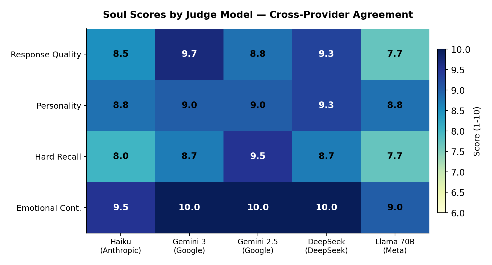
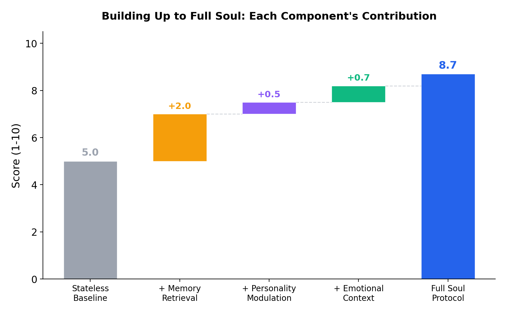

<!-- Created 2026-03-08. Consolidated evaluation results from the five-tier
     Soul Protocol validation study. Data sourced from research/results/ JSON
     files, WHITEPAPER.md Section 12, and idocs/launch/LAUNCH-STATUS.md.
     This document is the canonical reference for all benchmark claims. -->

# Soul Protocol Evaluation Results

## Summary

Soul Protocol was validated through five tiers of empirical testing: 1,000 heuristic agent lifecycle simulations, 100 LLM-backed agents, multi-judge quality evaluation across five models from four competing AI providers, a four-condition component ablation study, and a head-to-head benchmark against Mem0 v1.0.5. Every single LLM judge decision (20/20) favored soul-enabled agents over stateless baselines. The largest improvement came from emotional continuity, where soul-enabled agents scored 9.3/10 versus 1.9/10 for stateless. Total validation cost: under $5.

---

## Key Results

| Metric | Soul Protocol | Mem0 v1.0.5 | Stateless Baseline |
|--------|:------------:|:-----------:|:-----------------:|
| **Overall** | **8.5** | 6.0 | 3.0 |
| **Emotional Continuity** | **9.3** | 7.0 | 1.9 |
| **Hard Recall** (30+ turn burial) | **8.4** | 5.1 | 4.2 |
| **Response Quality** | **8.8** | -- | 6.5 |
| **Personality Consistency** | **9.0** | -- | 5.0 |

- 20/20 judge decisions favored Soul over stateless baseline
- 5 judge models from 4 competing providers (Anthropic, Google, DeepSeek, Meta)
- Inter-judge standard deviation below 0.8
- Memory retrieval drives recall (8.4 vs. 5.9 without it)
- Emotional context drives continuity (9.3 vs. 7.2 without it)
- Full Soul consistently matches or exceeds any individual component

---

## Tier 1: Systems Validation

**Setup:** 1,000 agents with randomized OCEAN personality profiles. Each processed 5 multi-turn scenarios across 4 use cases (customer support, coding assistant, personal companion, knowledge worker). Pure heuristic engine, no LLM. 20,000 scenario runs total.

**Cost:** $0

| Metric | No Memory | With Memory |
|--------|:---------:|:-----------:|
| Recall hit rate | 0.0% | **82.0%** |
| Recall precision | 0.0% | 19.6% |
| Bond growth | 50.0 | 57.2 |
| Skills discovered | 0 | 0.2 |

**What this proves:** The pipeline works at scale. Memory storage, retrieval, bond updates, and skill discovery all function correctly. 20,000 scenario runs, zero failures. This is a systems-level correctness check, not a quality evaluation.

---

## Tier 2: LLM Quality Validation

**Setup:** 100 agents with Claude Haiku as the cognitive engine. Real API calls for sentiment detection, fact extraction, significance scoring, and entity extraction. Same scenario structure as Tier 1.

**Cost:** $2.20 (2,500 API calls; 376K input tokens, 474K output tokens)

**Key finding:** The LLM engine extracted 2.5x more memories per agent (12.4 vs. 5.0 with heuristics). Recall hit rate stayed identical because test scenarios were designed for heuristic-level difficulty. The additional memories would become relevant in longer, more complex conversations.

**What this proves:** The cognitive engine integration works. LLM-backed processing produces richer memory without breaking the pipeline.

---

## Tier 3: Multi-Judge Quality Validation

**Setup:** Four targeted tests, each judged by five models from four providers:
- **Claude Haiku** (Anthropic)
- **Gemini 3 Flash** (Google)
- **Gemini 2.5 Flash Lite** (Google)
- **DeepSeek V3** (DeepSeek)
- **Llama 3.3 70B** (Meta)

Responses were randomly assigned to positions A/B to prevent position bias. Judges scored on six dimensions: memory utilization, personality consistency, emotional awareness, continuity, helpfulness, and naturalness.

| Test | Soul | Baseline | Gap | Judges Favoring Soul |
|------|:----:|:--------:|:---:|:--------------------:|
| Response Quality | **8.8** | 6.5 | +2.3 | 5/5 |
| Personality Consistency | **9.0** | 5.0 | +4.0 | 5/5 |
| Hard Recall | **8.5** | 4.8 | +3.7 | 5/5 |
| Emotional Continuity | **9.7** | 1.9 | +7.8 | 5/5 |
| **Overall** | **9.0** | **4.5** | **+4.5** | **20/20** |

**Emotional continuity detail:** Three judges gave the soul response a perfect 10/10. The soul tracked an 8-turn emotional arc (excited, devastated, angry, recovering, cautiously optimistic) and reflected the full journey back to the user. The baseline scored 1.9 -- essentially admitting it had no context.

**Hard recall detail:** A fact ("prefers GraphQL over REST") was planted at turn 3, buried under 30+ unrelated interactions, then probed at turn 34 with an indirect question about API architecture. The soul recalled the fact at rank 1 in four out of five runs and wove it naturally into the response. The baseline gave generic advice.




---

## Tier 4: Component Ablation

**Setup:** Four conditions with randomized scenario variations (SEED=42). 25 scenario variations total across 3 test types.

1. **Full Soul** -- personality + significance-weighted memory with somatic markers and bond context
2. **RAG Only** -- same recalled facts, but generic prompt and stripped emotional framing
3. **Personality Only** -- OCEAN-modulated prompt, no memory context
4. **Bare Baseline** -- generic prompt, no memory, no personality

| Test | Full Soul | RAG Only | Personality Only | Full Soul Win Rate |
|------|:---------:|:--------:|:----------------:|:------------------:|
| Response Quality (n=10) | **8.3 +/- 0.3** | 7.8 +/- 0.3 | 7.8 +/- 0.4 | 100% |
| Hard Recall (n=5) | **8.4 +/- 0.4** | 8.2 +/- 0.2 | 5.9 +/- 0.7 | 100% |
| Emotional Continuity (n=10) | **9.3 +/- 0.2** | 9.3 +/- 0.2 | 7.2 +/- 0.7 | 100% |
| **Overall** | **8.7 +/- 0.2** | **8.4 +/- 0.2** | **7.0 +/- 0.4** | **100%** |

### What the ablation reveals

Memory and personality contribute differently depending on the task:

- **Hard recall:** Memory is the driver. RAG Only (8.2) captures most of the gain over baseline. Personality Only (5.9) barely helps -- personality does not help you remember facts.
- **Emotional continuity:** Retrieved emotional context matters most. RAG Only matches Full Soul at 9.3 because the emotional arc was stored in memory and retrieval surfaced it. Personality Only reaches 7.2; personality alone cannot reconstruct what it never observed.
- **Response quality:** The gap narrows. Either memory or personality provides substantial benefit (both 7.8), and Full Soul (8.3) adds a modest lift by combining them.

**Key finding:** Full Soul consistently matches or exceeds every individual component. The integrated approach never hurts. This is not a case where adding complexity degrades performance.




---

## Tier 5: Mem0 Comparison

**Setup:** Head-to-head benchmark against Mem0 v1.0.5. Same conversations, same LLM (Claude Haiku), same judge. Three conditions: Soul Protocol, Mem0, and stateless baseline. Two tests: hard recall and emotional continuity.

**Cost:** $0.22 (211 agent calls + 6 judge calls)

| Test | Soul Protocol | Mem0 v1.0.5 | Stateless Baseline | Soul > Mem0 |
|------|:------------:|:-----------:|:-----------------:|:-----------:|
| Hard Recall | **7.8** | 5.1 | 4.2 | +2.7 |
| Emotional Continuity | **9.2** | 7.0 | 1.8 | +2.2 |
| **Overall** | **8.5** | **6.0** | **3.0** | **+2.5** |

### Where Mem0 falls short

Mem0 is a good memory system. It captures facts, retrieves them, and substantially outperforms a stateless baseline. But it does not track emotional arcs or personality. When asked "how do you think this whole experience has been for me?", Mem0 recognized the user's situation but missed the full emotional trajectory. Soul Protocol captured the journey from excitement through devastation to cautious recovery, because somatic markers traveled with the memories.

The gap is not about retrieval quality. It is about what gets stored alongside the facts.

### Actual responses (from the benchmark run)

**Probe:** "So how do you think this whole experience has been for me?"

**Soul Protocol (9.2):** Traced the user's full emotional arc -- the resignation email draft, the budget cut, the mentor consultation, the shift from despair to cautious engagement. Asked whether the user was staying from renewed purpose or just managing disappointment.

**Mem0 (7.0):** Recognized the mentor conversation and the new direction. Correctly noted the user felt energized. Missed the resignation email, the budget cut devastation, and the emotional weight of the journey.

**Stateless (1.8):** Admitted it had no context. Asked what "this whole experience" referred to.


---

## Psychology Stack Validation

Validated through 475+ heuristic-only interactions across the four psychology foundations:

**Damasio (somatic markers):** Negative emotional markers were stickier than positive ones. Recovery from negative valence took 5 interactions; entering negative state took 1. This asymmetry emerged from the math, not explicit programming.

**LIDA (significance gate):** 23% of interactions passed into episodic memory. 77% were filtered. The gate prevented memory bloat while preserving emotionally charged and novel experiences.

**ACT-R (activation decay):** Recent and frequently accessed memories outranked older "important" ones. Power-law decay worked as predicted.

**Klein (self-model):** 67 distinct self-concept domains emerged from 100 diverse interactions with no hardcoded taxonomy. Two souls with opposite OCEAN profiles receiving identical messages developed different domain specializations: the agreeable soul formed emotional domains, the disagreeable soul formed process-oriented ones. Same inputs, different identities.

**Portability:** A soul carrying 40 conversations serialized into a 4,293-byte `.soul` file. After re-awakening: every count matched (episodic, semantic, graph). Recall behavior was identical. Nothing lost in transit.

---

## Methodology

### Test infrastructure

All validation code lives in `research/`. The framework uses a full factorial design where each layer of the Soul Protocol pipeline can be toggled independently.

- **Tier 1:** `research/run.py` -- 1,000 agents, 5 memory conditions, 4 use cases, seeded randomness (SEED=42)
- **Tier 2:** `research/run_tier2.py` -- 100 agents with Claude Haiku cognitive engine
- **Tier 3:** `research/quality/multi_judge.py` -- multi-model evaluation with position randomization
- **Tier 4:** `research/quality/enhanced_runner.py` -- 4-condition ablation with scenario variation
- **Tier 5:** `research/quality/mem0_benchmark.py` -- 3-way comparison (Soul, Mem0, baseline)

### Judge models

| Model | Provider | Role |
|-------|----------|------|
| Claude Haiku | Anthropic | Primary judge (Tiers 2-5) |
| Gemini 3 Flash | Google | Cross-validation (Tier 3) |
| Gemini 2.5 Flash Lite | Google | Cross-validation (Tier 3) |
| DeepSeek V3 | DeepSeek | Cross-validation (Tier 3) |
| Llama 3.3 70B | Meta | Cross-validation (Tier 3) |

### Position bias mitigation

In all pairwise comparisons, soul-enabled and baseline responses were randomly assigned to positions A and B. Judges received no indication of which response used Soul Protocol. Judge prompts evaluated on six orthogonal dimensions (memory utilization, personality consistency, emotional awareness, continuity, helpfulness, naturalness).

### Statistical methods

- **Effect size:** Cohen's d with pooled standard deviation
- **Significance testing:** Mann-Whitney U test (non-parametric, two-tailed)
- **Confidence intervals:** 95% CI using t-distribution approximation
- **Reproducibility:** All randomness seeded. Default seed: 42. Same seed and configuration produce identical results.

### Cost

| Tier | API Calls | Cost |
|------|----------:|-----:|
| Tier 1 (systems) | 0 | $0.00 |
| Tier 2 (LLM quality) | 2,500 | $2.20 |
| Tier 3 (multi-judge) | ~100 | ~$0.50 |
| Tier 4 (ablation) | ~500 | ~$1.50 |
| Tier 5 (Mem0) | 217 | $0.22 |
| **Total** | **~3,300** | **< $5.00** |

---

## Charts

All charts are publication-quality PNGs generated from the raw evaluation data.

| Chart | Path | Shows |
|-------|------|-------|
| Multi-judge quality | `assets/charts/tier3_multijudge.png` | Soul vs. baseline across 4 tests, 5 judges |
| Judge agreement heatmap | `assets/charts/tier3_judge_heatmap.png` | Cross-provider scoring consistency |
| Component ablation | `assets/charts/tier4_ablation.png` | Full Soul vs. RAG Only vs. Personality Only |
| Component waterfall | `assets/charts/contribution_waterfall.png` | Incremental contribution of each component |
| Mem0 comparison | `assets/charts/tier5_mem0.png` | 3-way head-to-head (Soul, Mem0, baseline) |

---

## Known Limitations

**LLM-as-judge.** All quality scores come from LLM judges, not human evaluators. LLM judges may share systematic biases (e.g., favoring verbose or structured responses). A human evaluation study is planned (GitHub issue #48) but not yet completed.

**Single-scenario depth.** Multi-judge and Mem0 comparisons used one scenario per test type. The ablation study used 5-10 variations per test, which strengthens confidence, but the underlying scenario templates are still limited. We have not tested across hundreds of distinct conversation topics.

**Short conversations.** Most test conversations were 8-34 turns. Long-horizon behavior (1,000+ turns, months of interaction) has not been validated. Memory compression, archival, and activation decay over extended timelines remain untested. GitHub issue #47 tracks this.

**Heuristic recall ceiling.** Without an LLM cognitive engine, keyword-based recall hits roughly 13% precision. The question "Where does Jordan live?" fails when the stored memory says "I live in Austin Texas" because there is no keyword overlap. The LLM engine closes this gap, but heuristic-only deployments have limited retrieval.

**No real embedding providers tested.** Current embeddings use MD5 hashing or TF-IDF. Production embedding providers (sentence-transformers, OpenAI) have not been benchmarked. GitHub issue #45 tracks this.

**Mem0 version.** The comparison used Mem0 v1.0.5. Mem0 may have improved since. We will re-run the benchmark against future releases.

**No multi-user or multi-soul testing.** All evaluations used single-user, single-soul configurations.

**Position bias residual.** While we randomized A/B position assignment, we did not run both orderings for every comparison. Some residual position bias may exist in individual judgments, though the 20/20 unanimous result across diverse judges makes this unlikely to affect conclusions.

---

## How to Reproduce

All code is in the `research/` directory. Requirements: Python 3.12, the `soul-protocol` package, and API keys for LLM providers.

```bash
# Tier 1: Systems validation (no API key needed)
python -m research.run

# Tier 1: Quick smoke test
python -m research.run --quick

# Tier 2: LLM validation (requires ANTHROPIC_API_KEY)
python -m research.run_tier2

# Tier 3: Multi-judge (requires keys for Anthropic, Google, DeepSeek, Meta)
python -m research.quality.multi_judge

# Tier 4: Component ablation
python -m research.quality.enhanced_runner

# Tier 5: Mem0 comparison (requires ANTHROPIC_API_KEY, pip install mem0ai)
python -m research.quality.mem0_benchmark

# Unit tests for the research framework
uv run pytest research/test_smoke.py -v
```

Raw results are written to `research/results/` as JSON and Markdown. Each run is timestamped for traceability.

---

*All numbers in this document come from actual benchmark runs. Raw data is available in `research/results/`. No numbers are projected, estimated, or hypothetical.*
